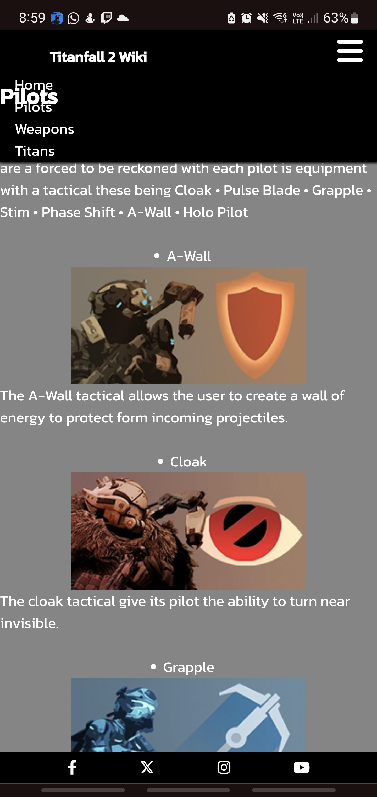

# Project Introduction

## Titanfall 2 Wiki

Titanfall 2 is a first-person shooter with a rich backstory. This wiki website aims to give information to the user on the weapons and abilities of the Titans and Pilots and the weapons they use.

[Titanfall 2 Wiki](https://mulloo.github.io/Titanfall-2-Weapon-Wiki/)

# User Experience

## Target Audience

- Users looking for information on the weapons of Titanfall 2.
- Users that are looking to discuss Titanfall 2.
- Users that are looking to compare the stats of Titanfall 2 Weapons

## User Stories

-

# Design

# Features

# Testing

# Bugs

- Navigation bar covering title in the header   - modify media query


- Headers over nav - modify z-index



- Hero image too long on portrait monitors media query for minimum height


# Citation

Love Running nav-bar
Love Running socials footer
Nav-bar toggle function used from Love running project.

[Alphacoders](https://wall.alphacoders.com/big.php?i=519153) Source for the hero image

Images for pilots taken from [Titanfall 2 fandom](https://titanfall2.fandom.com/wiki/Titanfall_2_Wiki).
all image content created by Respawn Entertainment.

buttons for gallery nav found in - w3chool

```html
<button onclick="document.location='index.html'">Home<button>
```
