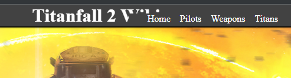
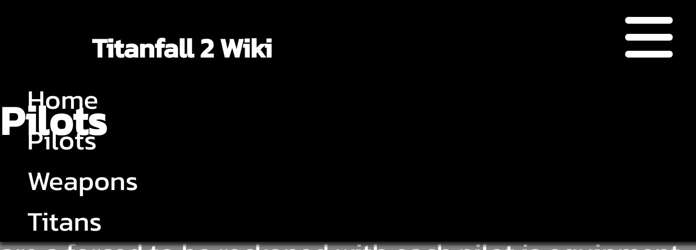

# Titanfall 2 Wiki

Titanfall 2 is a first-person shooter with a rich backstory. This wiki website aims to give information to the user on the weapons and abilities of the Titans and Pilots and the weapons they use.

The site can be accessed with the following link [Titanfall 2 Wiki](https://mulloo.github.io/Titanfall-2-Weapon-Wiki/)

## User Experience

### User Stories

### Design

## Target Audience

- Users looking for information on the weapons of Titanfall 2.
- Users that are looking to discuss Titanfall 2.
- Users that are looking to compare the stats of Titanfall 2 Weapons

## Features

## Navigation

### Navigation Bar

- The responsive navigation bar is implemented on all four pages including the title of the website and the links to Home, Pilots, Weapons and Titan.
- This feature will make the navigation of the site on both mobile or larger screen devices an easy task to accomplish.


## Testing

## Manual testing

| feature | action | expected result | tested | passed | comments |
| --- | --- | --- | --- | --- | --- |
| Navbar | | | | | |
| Home | Click on the "Home" link | The user is redirected to the home page | Yes | Yes | - |
| Pilots | Click on the "Pilots" link | The user is redirected to the Pilots page | Yes | Yes | - |
| Weapons | Click on the "Weapons" link | The user is redirected to the Weapons page | Yes | Yes | - |
| Titan | Click on the "Titans link"| The user is redirected to the Titans page | Yes | Yes | - |
| Nav Gallery |||||
| Home | Click the "Home" button |The user is redirected to the Home page | Yes| Yes |-|
| Pilot |Click the  "Pilot" button | The user is redirected to the Home page | Yes|Yes |-|
| Weapon | Click the "Weapon" button |The user is redirected to the Home page |Yes |Yes |-|
| Titan |Click the "Titan button" | The user is redirected to the Home page| Yes| Yes|-|
| Instagram icon in the footer | Click on the Instagram icon | The user is redirected to the Instagram page | Yes | Yes | - |
| Facebook icon in the footer | Click on the Facebook icon | The user is redirected to the Facebook page | Yes | Yes | - |
| Twitter icon in the footer | Click on the Twitter icon | The user is redirected to the Twitter page | Yes | Yes | - |
| YouTube icon in the footer | Click on the YouTube icon | The user is redirected to the YouTube page | Yes | Yes | - |
| Home page | | | | | |
| First name input | Enter the first name | The first name is entered | Yes | Yes | If the user doesn't enter the first name, the error message appears |
| Last name input | Enter the last name | The last name is entered | Yes | Yes | If the user doesn't enter the last name, the error message appears |
| Email input | Enter the email | The email is entered | Yes | Yes | If the user doesn't enter the email, the error message appears. If the user enters not a valid email, the error message appears |
| Password input| Enter the password| The password is entered | Yes| Yes| If the user doesn't enter the password, the error message appears.|
| "Submit" button | Click on the "Submit" button | The user is redirected to the response page | Yes | Yes | - |
| Response page | | | | | |
| Response message | The user will be automatically redirected to the home page after 10 seconds | The user is redirected to the home page | Yes | Yes | - |

## Bugs

- Navigation bar covering title in the header   - modify media query



- Headers over nav - modify z-index



- Hero image too long on portrait monitors media query for minimum height


## Citation

Love Running nav-bar
Love Running socials footer
Nav-bar toggle function used from Love running project.

[Alphacoders](https://wall.alphacoders.com/big.php?i=519153) Source for the hero image

Images for pilots taken from [Titanfall 2 fandom](https://titanfall2.fandom.com/wiki/Titanfall_2_Wiki).
all image content created by Respawn Entertainment.

buttons for gallery nav found in - w3chool

```HTML
<button onclick=" document.location='index.html'">Home<button>
```
