# Titanfall 2 Wiki

Titanfall 2 is a first-person shooter with a rich backstory. This wiki website aims to give information to the user on the weapons and abilities of the Titans and Pilots and the weapons they use.

The site can be accessed with the following link [Titanfall 2 Wiki](https://mulloo.github.io/Titanfall-2-Weapon-Wiki/)

## User Experience

### User Stories

### Design

## Target Audience

- Users looking for information on the weapons of Titanfall 2.
- Users that are looking to discuss Titanfall 2.
- Users that are looking to compare the stats of Titanfall 2 Weapons

## Features Implemented

## Navigation

### Navigation Bar

- The responsive navigation bar is implemented on all four pages including the title of the website and the links to Home, Pilots, Weapons and Titan.
- This feature will make the navigation of the site on both mobile or larger screen devices an easy task to accomplish.
  

### Navigation Gallery

- The navigation button style gallery is for the ease of the user. Most of the pages are full of content this is an easy method for the user to get from page to page and return the the top of each individual page as necessary.

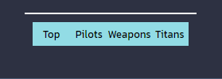
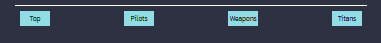

### Hero Image

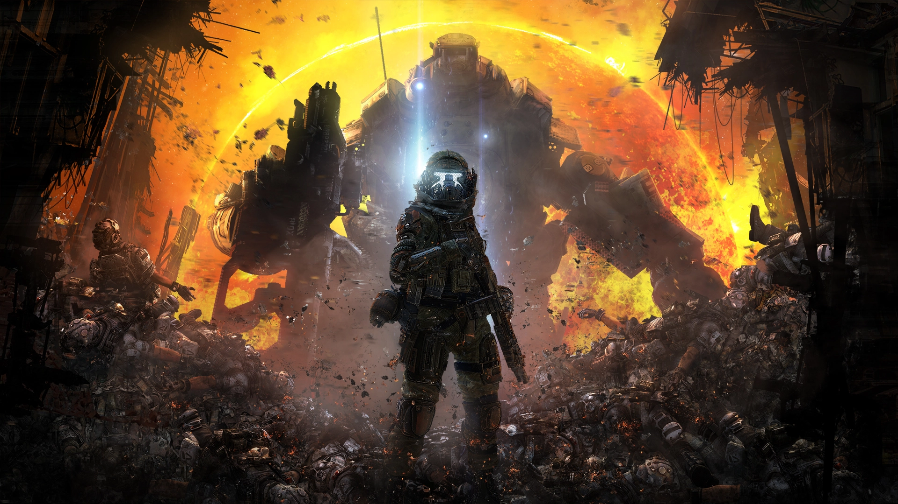

- The hero image tells the user that they are in the right place.

- It also grabs the user's attention and keeps them engaged in the site.

### Form

- The form section gives the user the ability to join the community of Titanfall 2 players.

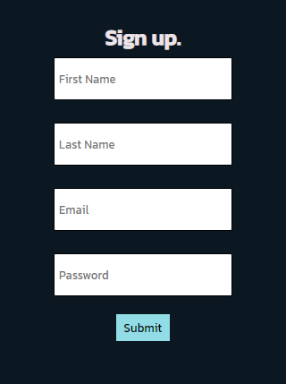

### Footer

- The footer has the social media links available for the user. These links will open in new tabs for the user's ease of use.

- This will allow the user to stay in contact with the community of the site.

## Features Not Implemented

- Titan page paragraphs as a table: not implemented due to time constraint.

## Testing

### Validator Testing

- HTML
  - No error was shown when the HTML was passed through the official [w3c HTML Validator](https://validator.w3.org/nu/?doc=https%3A%2F%2Fmulloo.github.io%2FTitanfall-2-Weapon-Wiki%2F)  

- CSS
  - No errors shown when the CSS was passed through the official [w3c CSS Validator](https://jigsaw.w3.org/css-validator/validator?uri=https%3A%2F%2Fmulloo.github.io%2FTitanfall-2-Weapon-Wiki%2F&profile=css3svg&usermedium=all&warning=1&vextwarning=&lang=en)

## Manual testing

| feature | action | expected result | tested | passed | comments |
| --- | --- | --- | --- | --- | --- |
| Navbar | | | | | |
| Home | Click on the "Home" link | The user is redirected to the home page | Yes | Yes | - |
| Pilots | Click on the "Pilots" link | The user is redirected to the Pilots page | Yes | Yes | - |
| Weapons | Click on the "Weapons" link | The user is redirected to the Weapons page | Yes | Yes | - |
| Titan | Click on the "Titans link"| The user is redirected to the Titans page | Yes | Yes | - |
| Nav Gallery |||||
| Home | Click the "Home" button |The user is redirected to the Home page | Yes| Yes |Works across all pages|
| Pilot |Click the "Pilot" button | The user is redirected to the Home page | Yes|Yes |Works across all pages|
| Weapon | Click the "Weapon" button |The user is redirected to the Home page |Yes |Yes |Works across all pages|
| Titan |Click the "Titan button" | The user is redirected to the Home page| Yes| Yes|Works across all pages|
| Instagram icon in the footer | Click on the Instagram icon | The user is redirected to the Instagram page | Yes | Yes | - |
| Facebook icon in the footer | Click on the Facebook icon | The user is redirected to the Facebook page | Yes | Yes | - |
| Twitter icon in the footer | Click on the Twitter icon | The user is redirected to the Twitter page | Yes | Yes | - |
| YouTube icon in the footer | Click on the YouTube icon | The user is redirected to the YouTube page | Yes | Yes | - |
| Home page | | | | | |
| First name input | Enter the first name | The first name is entered | Yes | Yes | If the user doesn't enter the first name, the error message appears |
| Last name input | Enter the last name | The last name is entered | Yes | Yes | If the user doesn't enter the last name, the error message appears |
| Email input | Enter the email | The email is entered | Yes | Yes | If the user doesn't enter the email, the error message appears. If the user enters not a valid email, the error message appears |
| Password input| Enter the password| The password is entered | Yes| Yes| If the user doesn't enter the password, the error message appears.|
| "Submit" button | Click on the "Submit" button | The user is redirected to the response page | Yes | Yes | - |
| Response page | | | | | |
| Response message | The user will be automatically redirected to the home page after 10 seconds | The user is redirected to the home page | Yes | Yes | - |

## Bugs

### Solved Bugs

- Navigation bar covering title in the header fixed by change the media query px size.

- Headings showing up over nav menu fixed by changing the z-index in css.

- Hero image too long on portrait monitors media query for minimum height added.
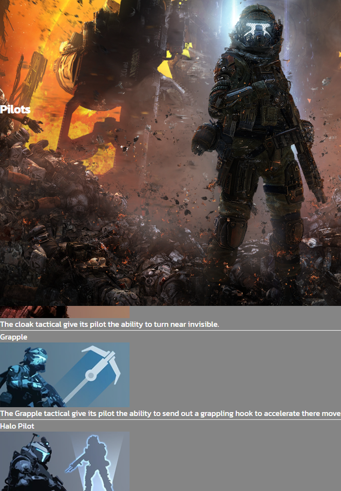

- Welcome div text moving behind the form background color removed div height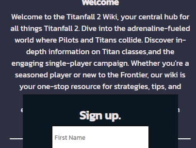

### Unsolved Bugs

- None

### Mistakes

- Some commit messages used the wrong prefix ie(fix: add: change:)
- Unordered lists were originally used for the titan pilot and weapons pages and leaving little room for adaptability later in development.

## Lighthouse report

### Home

- Lighthouse Home page mobile
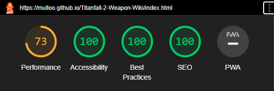

- Lighthouse Home page desktop report
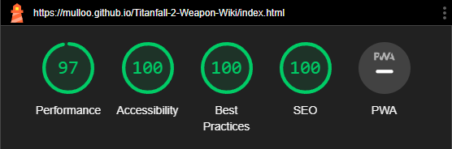

### Pilots

- Lighthouse Pilots page mobile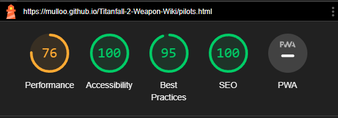

- Lighthouse Pilots page desktop report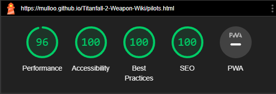

### Weapons

- Lighthouse Weapons page mobile report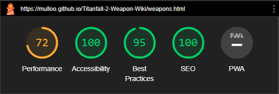

- Lighthouse Weapons page desktop report

### Titans

- Lighthouse Titans page mobile report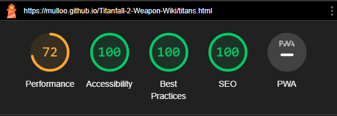

- Lighthouse Titans page desktop report

## Deployment

To publish the website, I utilized GitHub Pages as the hosting platform. Here's a breakdown of the deployment process:

- Navigate to the GitHub repository and access the "Settings" tab.

- In the "Settings" tab, scroll down to the "Source" section. Locate the drop-down menu and opt for the "Master Branch" from the available options.

- Following the selection of the master branch, GitHub Pages will refresh the page automatically. Keep an eye out for a ribbon display, providing a detailed confirmation of a successful deployment.

For live site access, follow this [link](https://mulloo.github.io/Titanfall-2-Weapon-Wiki/)

This deployment method ensures that the most recent version of your project on the master branch is accessible via the live link. It offers a straightforward means to share and present your project online using GitHub Pages.

## Citation

### Content

- The toggle navigation menu was implemented from the [Love Running project](https://github.com/Code-Institute-Solutions/love-running-v3/tree/main)
- Footer Social Icons were taking from [Font Awesome](https://fontawesome.com/)

### Media

[Alphacoders](https://wall.alphacoders.com/big.php?i=519153) Source for the hero image image owned and created by Respawn Entertainment.

All other images Sourced form [Titanfall 2 fandom](https://titanfall2.fandom.com/wiki/Titanfall_2_Wiki) all images created by Respawn Entertainment.
